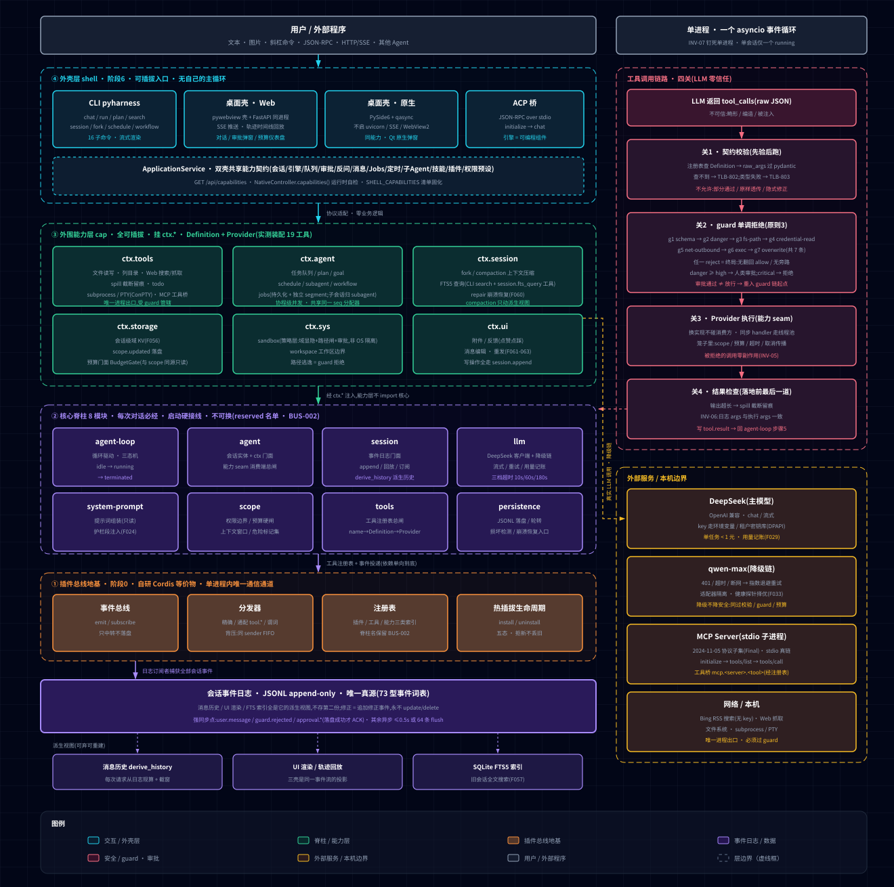

# PyHarness — DeepSeek Harness 的 Python 全功能复刻

> 一句话: 用 Python 复刻 DSH 全部架构思想(非源码翻译)的 Agent 框架——事件溯源会话 + 工具管道 + 自研插件总线,66 项清单按代码/入口落地,6 阶段开发,Windows 桌面程序形态;关键主链均有可重复真链探针。
> 当前被测代码、测试统计与安装证据见 [STATUS.md](STATUS.md)。2026-09-21 的 2,110 collected / 2,106 passed / 4 skipped 及历史真实模型探针，仅适用于当时报告的版本和环境，不能代替当前验收。项目包含真实运行时、治理、持久化、CLI、ACP、Web 和原生入口；确定性模型测试不证明真实模型自主规划。

## Platform Web V1

`pyharness-desktop` 的 Web 首页现为真实数据驱动的中文工作台，原管理界面保留在 `/classic`。
新平台包括会话、Run、审批、Agent 版本、Artifact、知识检索、连接与计划任务，以及默认拒绝执行的 Sandbox 策略。
参阅 [工作台指南](docs/user-guide/web-workbench.md)、[架构与 API](docs/architecture/platform-web-v1.md)、[安全边界](docs/security/sandbox-boundary.md) 和 [本轮报告](reports/PYHARNESS-PLATFORM-WEB-V1.md)。
当前机器的 Docker daemon 不可用；本轮没有读取用户模型凭据，真实模型和真实容器验收均准确记录为环境阻塞。`host_approved` 不具备 OS 级隔离。

## 从 Agent Demo 到 Governed Agent Runtime（从智能体演示到治理型智能体运行时）

> 多数 Agent 仓库停在「能跑通一次对话」。本项目把**运行时治理**当成一等公民：工具执行经
> `authorize()` **唯一授权入口**（关 2，**AST 判定恰 1 处调用**），guard **g1–g7 单调拒绝**
> （可拒绝、不可放行），每次授权留下 `decision.issued` **决策留痕**与 `receipt.emitted`
> **可校验凭证**（带 `prev_hash` 链）。
>
> **读侧同样可达**：决策因果还原、被拒清单（含"拦了且没执行"的证据位）、一致性对账
> （`SEQ-GAP` / `NO-GUARD-EVENT` / `NO-RECEIPT-FOR-GRANT`）、**凭证逐条重算核验**
> ——全部经 `ApplicationService` → Web 路由 `/api/sessions/{sid}/governance-audit` 与原生壳
> 审计页可达（`/api/sessions/{sid}/governance-evidence` 另有证据归档面）。LLM 出网有**单一闸**
> （`LLMClient._egress_guard`，五个出口的唯一汇点）约束会话预算。
>
> 5 条架构不变量（INV-01~05）被转成**可执行断言**，并以 mutation 反证测试自身的鉴别力 ——
> 此处 INV-01~05 为**运行时事实来源（runtime inventory）**，`docs/INVARIANT_REGISTRY.md` 的
> INV-01~09 为编号层 / 历史记录。
> 治理边界、**负空间**（明确"不治理"的部分）与未实现项**如实公开**：[LIMITATIONS.md](LIMITATIONS.md)。

## 从这里开始(Current State)

> ⚠️ **当前能力与已知限制见 [LIMITATIONS.md](LIMITATIONS.md) —— 建议先读它。**
> 历史治理阶段报告及本机基线快照未纳入 Engineering RC 分发文件。保留的规格中如引用历史报告，属于历史来源说明；当前候选范围与运行证据见 `STATUS.md` 和 `reports/PYHARNESS-ENGINEERING-RC-20260924.md`。

| 想了解 | 读 |
|---|---|
| **当前能力 / 未实现限制** | **[LIMITATIONS.md](LIMITATIONS.md)** |
| 架构总览(视图) | [docs/MAP.md](docs/MAP.md) |
| 架构决策(22 条 ADR,每条含"违反后果") | [docs/ADD.md](docs/ADD.md) |
| 治理型运行时:目标架构与逐模块迁移映射 | [GOVERNED_AGENT_RUNTIME_DESIGN.md](GOVERNED_AGENT_RUNTIME_DESIGN.md) |
| 面试向单点导览(不变量测试面) | [治理不变量索引](docs/INVARIANT_REGISTRY.md) |
| 开发过程(阶段报告) | 历史阶段记录保留于 Git 历史；当前验收见候选报告 |


## 治理不变量测试面(S6-2b,已冻结)

> **S6-2b 是什么**:把「治理型 Agent 运行时」的 5 条架构不变量(INV-01~INV-05)转成 **31 条可执行断言**,用「若该性质被破坏,测试是否必然失败」的口径逐条证伪,并以 **14 次 mutation** 反证测试自身的鉴别力。
> **完成了什么 / 为什么值得看**:它不只补了测试 —— 这套方法**真的抓出一条 P0 生产违约**(`auto_title` 越过 Agent Loop 直调对话出口,违反 INV-02),根因是规格指定的 `mini` 出口在实现中缺失;修复**仅 +15 行生产代码**,并以类别式出口边界(而非例外名单)固化。
> 冻结锚点 `a0c0917` · 完整导览:**[治理不变量索引](docs/INVARIANT_REGISTRY.md)**

## 架构图

**🔗 交互式架构图(可缩放,一页看全):<https://zinuotiger.github.io/pyharness/architecture.html>**

[](https://zinuotiger.github.io/pyharness/architecture.html)

> 单进程四层架构(插件总线地基 → 核心脊柱 8 模块 → 外围能力层 → 外壳层)+ 工具调用四关(契约校验 → guard 单调拒绝 → Provider 执行 → 结果检查)+ 外部服务边界。
> 资产:`docs/architecture.html`(自包含页)· `docs/architecture.svg`(矢量)· `docs/architecture.png`(2x 位图)。


## 2026-09-11 修复完成

> 本轮针对审计发现的“模块存在但入口未接线”问题做了收口,并补了可重复的真实探针:

| 修复 | 结果 |
|---|---|
| CLI chat/run 接真实 AgentLoop | `pyharness run "..."` / `chat` 不再 CYC-999 |
| plan/schedule/job/search/session/fork | 六类单发命令均有真实 handler |
| jobs/subagent/schedule/plan 编排 | engine spine 装配,jobs/subagent 有真实 runner 与持久化子会话 |
| ACP | `initialize → chat` 惰性接真实引擎、队列与 LLM |
| MCP | `scripts/probe_mcp_stdio.py`:真实 stdio `initialize → tools/list → tools/call` PASS |
| Web 搜索 | 默认 Bing RSS 无 key 后端;`scripts/probe_web_search.py` PASS |
| 流式 | 修复降级链吞掉 `chat_stream` 的缺陷;`scripts/probe_streaming_real.py` 收到真实 chunk |
| 持久化 | `llm.chunk` 等瞬时事件不再误进 JSONL 持久化订阅 |
| 桌面 UI | 新增 Jobs / 定时任务 / 子 Agent 三个管理面板,后端 REST 路由与测试同步接入 |
| 服务层 | 新增 `ApplicationService`,会话/引擎/队列/审批/反问/消息/Jobs/定时/子 Agent/技能/插件/权限预设/只读投影已从 FastAPI 壳抽离;桌面壳委托服务层 |

## 2026-09-12 双壳能力对齐

> 共享层新增 `pyharness/application/models.py`,并把双壳能力清单固化为 `SHELL_CAPABILITIES`;测试会同时检查服务层、Web 路由、Qt Controller 和两端 UI 入口。

| 功能 | Web 壳 | PySide6 原生壳 | 共享服务 |
|---|---|---|---|
| 会话 / 聊天 / 流式 | ✅ | ✅ | `ApplicationService` |
| 编辑 / 重发 / 点赞点踩标记 | ✅ | ✅ | ✅ |
| 附件 / 权限档位 | ✅ | ✅ `QFileDialog` + `QComboBox` | ✅ |
| Jobs / 定时 / 子 Agent | ✅ | ✅ | ✅ |
| Skill 本地管理与 Registry | ✅ 搜索/版本/安装/回滚/卸载 | ✅ 同能力 | `SkillInstaller` |
| 插件 / Workflow / 审计 | ✅ | ✅ | ✅ |
| 审批 / 反问 | Web 弹窗 | Qt 原生弹窗 | ✅ |
| 租户 / 模型 API Key | 设置页 | 设置页 | 租户密钥库 |

能力契约可运行时读取:Web `GET /api/capabilities`,原生 `NativeController.capabilities()`。

### 租户隔离与模型设置

- Web 顶栏 `⚙ 设置`、原生壳 `设置` 页都可以创建/切换租户并配置任意 OpenAI 兼容模型。
- 每个租户拥有独立会话目录、技能目录、插件根目录和模型档案；同名模型使用独立适配器，禁止复用其他租户的 Key。
- API Key 是只写字段；接口返回配置状态和来源类别，不返回明文或宿主秘密引用。Windows 内容使用当前用户 DPAPI 加密，文件访问取决于目录 ACL；POSIX 在写入秘密前以 0600 创建临时文件，不能把 POSIX 权限位当作 Windows 访问隔离。
- 普通租户模型档案禁止宿主 `env:` / `file:` 引用；只有 `default` 操作者档案保留此能力。普通租户未配置活动档案时不会继承宿主真实模型凭据。历史不安全引用会被拒绝。
- 凭据字段未提供或为空表示保留；新直接值或允许的引用表示替换；`clear_api_key: true` 表示清除。更换端点须同时明确替换或清除凭据。元数据指向已提交的秘密代；`cleanup_pending` 表示旧代文件尚待清理，不能理解为物理删除已完成。
- Web 通过 `X-PyHarness-Tenant` 声明租户、SSE 通过 `tenant` 查询参数绑定租户；`default` 之外的租户还须出示**该租户的令牌**（`~/.pyharness/tenants/<tenant>/token`，见 `docs/CFG.md` §9 与 ADR-023）。
- Web 左侧会话列表支持右键删除：右键会话后在鼠标位置出现“删除会话”，二次确认后按 `storage.archive_days` 归档主 JSONL、轮转段和备份；默认保留 30 天，设为 0 才永久删除；运行中或队列有待处理任务的会话拒绝删除。
- 凭据修改/撤销后，旧端点或旧版本绑定拒绝继续发送请求；按 `restart_required` 重启应用或创建采用新配置的会话。这不能撤回已发送的请求或远端副作用。
- 当前隔离范围是应用级逻辑租户；插件/MCP 的进程级配置仍由部署者管理，不应把它当作恶意本地用户的强安全边界。

## 2026-09-08 增量(砍掉项复活 + UI 波)

> 承接 9-07 基线,全量补齐 DSH 功能清单的"砍掉"项并接线,每项带单测锁证(全量回归 87% 绿):
>
> | 族 | 复活/新增项 | 落点 |
> |----|------------|------|
> | 工具 | **bash/代码执行/子进程工具**(exec.shell_run·python_run·proc.start/status/kill,审批门控 + cwd/env/超时/配额约束;**非 OS 级沙箱**) | core/proc.py + tool_exec.py |
> | 工具 | **MCP 客户端**(2024-11-05 协议子集,Inline/Stdio,工具桥 mcp.<name>.<tool>) | core/mcp.py |
> | 工具 | **消息编辑/重发**(经公开 append 追加 message_edited,保留 append-only 卖点) | core/message_edit.py |
> | 工具 | **workflow 顺序编排**(workflow.step 事件) | core/workflow.py |
> | 编排 | **LLM 自动标题 F042**(run 收尾命名→session.renamed,幂等) | core/auto_title.py + engine 钩子 |
> | 编排 | **agent 反问 #38**(user.question/answer 事件 + AskProvider + 桌面弹窗) | core/user_ask.py + tool_ask.py |
> | 插件 | **插件装载器 + HMR**(单文件插件 MANIFEST→register_tools,装载前清 pyc) | core/plugin_loader.py |
> | 系统 | **本地遥测/审计导出** | core/telemetry.py |
> | 计量 | 预算硬闸 F032(budget.paused)+ scope.updated 落盘 | llm.py + events |
> | 桌面 | 编辑/重发/反馈/反问/标题/附件/webhook API + 前端操作条与反问弹窗(node --check 通过) | pyharness/desktop/ + ui/index.html |
> | 真链 | scripts/probe_real_chain.py(真实 LLM 端到端;需 DEEPSEEK_API_KEY 或时代中转) | scripts/ |


## AI 编码地图(从哪开始读)

| 目的 | 读什么 |
|------|--------|
| 先懂全局 | MAP.md(架构总览图)→ PRD-Core.md §1-2 |
| 了解设计决策 | ADD.md(ADR 索引与正文,每条含"违反后果") |
| 写核心代码 | DIS-CORE.md(脊柱 8 模块伪代码)+ specs/(编码规格) |
| 写能力代码 | DIS-SEAM.md(seam 三件套+插件总线)+ specs/ |
| 事件格式 | EVENT-SCHEMA.md(信封/词表/JSONL) |
| 安全实现 | SECURITY.md(威胁模型/guard/审批)+ CONSTRAINTS-03 |
| 错误码 | ERR.md(全量目录+排查) |
| 配置 | CFG.md(全量配置项) |
| 跑起来 | DEP.md(6 阶段运行指南+面试演示脚本) |
| 运维 | OPS.md(故障排查)/ SOP.md(标准操作流程) |
| 优化查漏 | FLC.md(全链路优化清单) |
| 经验沉淀 | KEY-FINDINGS.md(坑位 14 条+面试讲法) |
| 质量记录 | IMPACT-MATRIX.md(矛盾扫描与修复) |
| 硬约束 | CONSTRAINTS-01~08(违反=不合格) |

## 文档导航(2026-09-06 全量刷新)

| 分组 | 文档 | 大小 |
|------|------|------|
| 需求 | PRD-Core.md | 123KB |
| 架构 | MAP.md / ADD.md | 24KB / 44KB |
| 设计 | DIS-CORE.md / DIS-SEAM.md | 72KB / 56KB |
| 协议 | EVENT-SCHEMA.md | 42KB |
| 安全 | SECURITY.md | 37KB |
| 集成 | ADI.md(LLM 对接) | 34KB |
| 工程 | ERR.md / CFG.md / DEP.md | 32KB / 28KB / 33KB |
| 运维 | OPS.md / SOP.md | 28KB / 22KB |
| 约束 ×8 | CONSTRAINTS-01~08 | 40KB |
| 优化 | FLC.md | 6KB |
| 沉淀 | KEY-FINDINGS.md / IMPACT-MATRIX.md | 17KB / 4KB |
| 编码规格 | specs/(33 份,313 函数)→ [索引](docs/specs/README.md) | 596KB |
| 文档站 | [交互式架构图](https://zinuotiger.github.io/pyharness/architecture.html) | 在线查看(一页看全) |

## 技术栈
Python 元数据要求 >=3.11（本轮具体被测版本见 STATUS）· pydantic · JSONL 事件溯源 · DeepSeek + qwen-max 降级 · pytest · asyncio · SQLite FTS(查询) · **pywebview 桌面壳 + FastAPI(外壳)**

基础包仅需 pydantic、PyYAML、httpx。独立环境按入口安装：基础包用于 CLI/ApplicationService；`.[desktop]` 用于 Web；`.[native]` 用于原生桌面。`uv sync --all-extras` 的开发环境不能替代最小安装验收。依赖未缓存时安装需要网络。

## PySide6 原生桌面(MVP)

```powershell
python -m pip install ".[native]"
pyharness-native
```

原生版直接运行 `QApplication + qasync + ApplicationService`,不启动 FastAPI、uvicorn、SSE 或 WebView2。当前包含会话、聊天、流式草稿、消息编辑/重发/反馈、附件、权限档位、轨迹、Jobs、定时任务、子 Agent、技能 Registry、插件、Workflow 和审计面板。技能页支持 Registry 搜索、SHA-256 校验、quarantine 安装、卸载和版本回滚。Web 桌面仍可用:`pyharness-desktop`;两套壳共享同一业务服务和能力契约。

当前暂时禁用 `exec.pty` 及底层 PTY 启动，返回 `TLB-807`；安装 pywinpty 不会重新启用。命令执行可用受治理的 `exec.shell_run`、`exec.python_run`、`proc.*`。这不是操作系统沙箱；同步工具取消不能保证停止线程，超时/取消不代表副作用撤销。

Web 仅监听 `127.0.0.1`、`localhost`、`::1`；localhost 归一到 IPv4，IPv6 URL 使用方括号。就绪须同时满足本次服务已启动和实际地址可连接。evleven 是单独安装与运行的外部 MCP 服务，不属于 PyHarness 内存实现。

## 核心架构(一句话版)
单进程插件架构: 自研插件总线(地基)→ 8 模块核心脊柱(agent-loop/session/tools/llm/system-prompt/scope/agent/persistence,不可换)→ 40+ 能力挂 ctx.*(可插拔)→ CLI/**Windows 桌面程序(pywebview)**/ACP 外壳。会话日志 append-only 是唯一真源,消息历史从日志派生。guard 单调拒绝,LLM 零信任。

## 开发路线(6 阶段,每阶段可运行)
| 阶段 | 内容 | 里程碑演示 |
|:---:|------|-----------|
| 0 | 插件总线+事件分发 | demo_bus 跑通 |
| 1 | 核心脊柱(循环/工具/日志/持久化/降级/guard) | 查天气+危险拦截 |
| 2 | 流式/重试/token 计量 | 流式输出 |
| 3 | 文件/Web 工具/spill/todo | 整理文件夹 |
| 4 | 任务队列/plan/子 Agent/jobs | 多任务指派 |
| 5 | 会话查询/compaction/fork/sandbox | 长会话压缩 |
| 6 | CLI 完整/**桌面程序(pywebview:对话+轨迹回放+审批)** | 双击 exe 桌面对话 |

## 面试叙事(30 秒版)
"我完整分析了 DeepSeek Harness(9,044 文件),然后用 Python 全功能复刻了它的架构——事件溯源会话日志、guard 单调拒绝的工具管道、能力 seam 三件套、自研插件总线,66 项功能分 6 阶段推进,产出 60 份文档 1.24MB(含 32 份编码规格/313 函数),每阶段可运行可演示,最终形态是双击即用的 Windows 桌面程序,带 Agent 干活轨迹回放。代码和全套规格文档都在 GitHub。"

## 关联
- [需求基线](docs/PRD-Core.md) / [架构决策](docs/ADD.md)
- TECH-ANCHOR.md(根目录,技术锚定 + 变更记录)
- pyharness/（当前实现；具体已验证范围见 STATUS.md）

---

_文档时间戳：2026-09-21T13:45:00+08:00_
